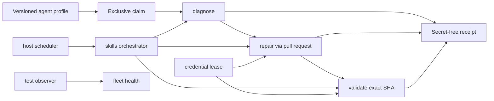
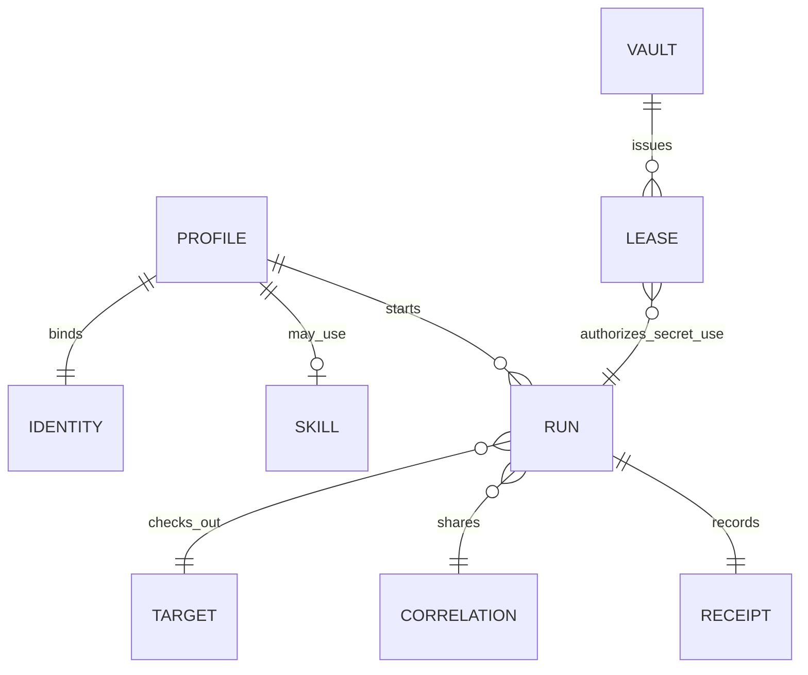

# Agent architecture

## Scope and standard composition

The agent standard describes declared roles, isolation, mutation policy and
secret-free run evidence. It does not run a fleet, store credentials, merge
pull requests or replace domain agents.

It generalizes verified Subactor experience:

- `doctor-agent` diagnoses and writes evidence; it does not repair products;
- `repair-agent` claims one item and mutates only through a pull request;
- `validator-agent` independently checks an exact head SHA; LLM review is
  advisory;
- `skills-agent` orchestrates `doctor → repair → validator` and does not
  replace those execution planes;
- `test-agent` observes fleet health and writes only when separately granted;
- `onedev-agent` is a token-bearing scheduler; untrusted PR code runs, if at
  all, in a networkless executor without secrets;
- `credential-vault` issues short leases and never appears in receipts.

Composition:

- `wellmanifest/dsl` constrains agent requests;
- POA compiles requests into exact plans, grants and receipts;
- `ticket-lifecycle` and `git-lifecycle` own ticket and Git transitions;
- `account-runtime` may later bind identity;
- `saas-lifecycle` may later bind an `agentRef` as an operational element.

## Normative invariants

1. Every profile MUST declare one `kind`, one `lane`, one `mutation` and one
   `identityRef`. Kind and lane are coupled: doctor diagnoses, repair repairs,
   validator validates, test observes, skills/control orchestrate, runtime
   executes, vault leases.
2. Only `repair` MAY mutate, and only through `pull-request`. Doctor,
   validator, skills, control, test, runtime and vault mutation is `none`.
3. `llmAuthority` is `advisory`. A model verdict cannot approve, merge or
   create a grant.
4. `storesCredentials` is always false. Credentials move through a separate
   vault lease; receipts and requests MUST NOT carry secret values.
5. A token-bearing `host-scheduler` MUST set `executesUntrustedCode=false`.
   Untrusted code, if executed, uses `networkless-executor` with no secrets.
6. Repair and validator MUST use distinct `identityRef` values.
7. `claim`, `diagnose`, `repair`, `validate` and `orchestrate` target only
   `product` repositories. Control-plane agents are not product repair
   targets.
8. `repair` and `validate` require an exact 40-character head SHA.
9. An active claim (`claimed`, `diagnosing`, `repairing`, `validating`) MUST
   have a forward-bounded `claimedUntil`.
10. One `correlationRef` binds the doctor, repair and validator steps of a
    single unit of work.
11. Receipts MUST set `secretsRedacted=true` and `credentialsStored=false`.
    Documents are not execution authority.

## Trust boundaries

| Boundary | Owns | Must reject |
| --- | --- | --- |
| Agent profile registry | Kind, lane, mutation, isolation, identity | Doctor that repairs, shared repair/validator identity |
| Skill catalog | Orchestration order and artifacts | Replacing execution agents |
| Vault | Short-lived leases | Secret values in metadata or receipts |
| Host scheduler | Polling and dispatch | Executing untrusted PR code with a token |
| Isolated workspace | Exact-SHA checkout | Host shell or arbitrary executables |
| Receipt store | Redacted outcome hashes | Tokens, argv, merge commands |

## Lane ownership

A later SaaS or product catalog may point at `agent://.../vN`. It cannot
invent a lane or turn an observer into a mutator.
