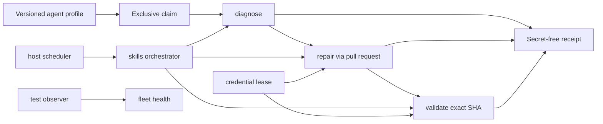
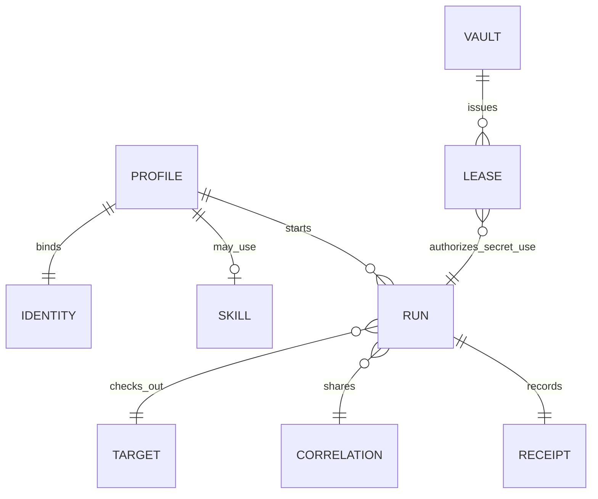

# Agent architecture

## Scope and standard composition

The agent standard describes declared roles, isolation, mutation policy and
secret-free run evidence. It does not run a fleet, store credentials, merge
pull requests or replace domain agents.

It generalizes verified Subactor experience:

- `diagit` observes local and remote fleet state as stable, target-qualified
  findings; its generated plans are evidence-bound proposals, not authority;
- `doctor-agent` diagnoses and writes evidence; it does not repair products;
- `repair-agent` claims one item and mutates only through a pull request;
- `validator-agent` independently checks an exact head SHA; LLM review is
  advisory;
- `skills-agent` orchestrates `doctor → repair → validator` and does not
  replace those execution planes;
- `test-agent` observes fleet health and writes only when separately granted;
- `onedev-agent` is a token-bearing scheduler; untrusted PR code runs, if at
  all, in a networkless executor without secrets;
- `credential-vault` issues short leases and never appears in receipts.

The current evidence basis is Diagit `b6958c40598adcc44dd02e184bc7dc92325a90b9`
and Doctor `1aed648d7c45588cf1e04d95ce315b64251c80bd`. These revisions support the
rules below but are not runtime dependencies of the standard.

The credential-authority refinement is additionally grounded in exact reviewed
and merged Subactor revisions: Inventory `082e8fc954a0554458c4f08456e8e18009579d5d`
(merge `1c6cdf5a1acee02ae1e754c3d6f12ea72a65c1e2`), Hub
`1183d80b1460f8f1ad339ce7e224e8db3c02f3f8` (merge
`485997c345ea1da19320eb5a384bbd8941a91d4f`), the credential-harvest connector
`ae7f8e80419afebf28f2b77c3627e3984c5a9cac` (merge
`f941dd9fdd8949d77b4808000caf05da09832dd6`) and Control
`8dbbb1570bdb3abe6a2e458c3ec24b115327f398` (merge
`cb611df46bbb99b1dba8b1f608eb231ba0e28321`). These revisions prove exact
metadata selection, an internal password-manager resolver, connector-side
selection proof and controller-owned issue/revoke behavior respectively.

Hub route head `62fdd105a9263b2c6bdc8e86db95145edb70365c` (merge
`3bc723fe9ca7b3a774c0f67a22595c06e8f4ec7c`) now exposes the authenticated
exact-reference operation consumed by the connector. Regression head
`f59cc503312c8e58a651fbd6bc944afd005e6920` (merge
`feb2548401a49757018baa2c6607ba0b8ce90f1e`) permanently proves bearer and
request validation, byte-exact delegation, secret-free response and legacy
compatibility. The compatible hops are therefore structurally present, but
these revisions do not prove a live controller-issued grant, real
password-manager/Vault resolution, revocation and independent read-back canary.
That operational state remains unproven and MUST NOT be inferred from route or
ASGI tests. The evidence-window rule is separately grounded in Core
`bf041fc6a9d72cde6e7757d14dac8d5685639676` (merge
`16b259d4ca42c1b10888296e56c16fc3619fa943`), which reproduced a false
coverage regression caused by an asymmetric ten-commit extraction window and
removed it by binding the maximum supported bounded window of 100 commits.
All of these revisions are evidence, not runtime dependencies of the standard.

The publication-identity refinement is grounded in Doctor Agent head
`4f1156dad200a94447c28ceeda4b7fc46084c88b` (merge
`a64d5330ee3f9f0135e39797a1685a6e18cb117d`) and Validator run
`31814901052`. The exact head passed Doctor's hosted checks, but validation
stopped before examining it because Doctor has no issuer for Validator's
universal `ticket-NNN`/`PLF-N` input. This proves an identity-routing gap; it
does not authorize a fabricated ticket or make either repository a dependency.

Composition:

- `wellmanifest/dsl` constrains agent requests;
- POA compiles requests into exact plans, grants and receipts;
- `ticket-lifecycle` and `git-lifecycle` own ticket and Git transitions;
- `account-runtime` may later bind identity;
- `saas-lifecycle` may later bind an `agentRef` as an operational element.

### One-time repository publisher companion

The closed `agent/v1` vocabulary remains unchanged: Repair is still the only
generic agent that mutates product code, and it still does so only through a
pull request. A repository with no refs cannot use that lane. The additive
`wellmanifest.repository-publisher-agent/v1` profile instead describes a
domain controller for exactly one `repository:initial-ref` operation.

The canonical profile binds `agent://subactor/repository-publisher-agent/v1`
to the immutable Skills operation profile at
`54d71ad2ec04896a1591d14d22de54562bafd4a1` and the immutable Git lifecycle
contract at `72ade3b6c7ad68f617a50871a1f7466e7a868ab9`. These coordinates are
data-contract dependencies, not remote runtime fetches. An adopter resolves
and verifies local pinned copies before execution.

The publisher accepts only a remote with zero refs and an isolated exact source
commit. It consumes a fresh digest-bound, single-use grant that cannot be
inherited from repository creation or bootstrap. It cannot force, execute the
source code, store credentials, self-validate or delete a quarantined ref.
Publication produces a non-terminal receipt. Only an independent
`validator-agent` read-back can emit the terminal `accepted` or `quarantined`
state.

The runtime service is HOME `subactor` and ADOPTS the Wellmanifest Agent,
Skills and Git lifecycle packs. Wellmanifest owns this portable role contract,
not the daemon, queue consumer, Git transport or credentials. Until an adopter
implements the profile and registers its exact route, Skills may propose the
operation but the runtime must remain blocked.

### HOME versus ADOPT placement

Placement and conformance are separate declarations. `HOME` names the
organization that owns the repository or runtime; `SHAPE` is `domain_pack`,
`runtime_service` or `both`; `runtimeOwner` names who operates a CLI or daemon;
and `ADOPT` lists the versioned Wellmanifest packs the artifact follows.
Adopting `wellmanifest/agent`, `wellmanifest/new-project` or another pack does
not transfer runtime ownership to Wellmanifest.

Within this repository family, Wellmanifest is HOME for standards and domain
packs. Product agent CLIs, daemons and runtime services are HOME in a runtime
organization such as Subactor or Semcod and ADOPT the applicable Wellmanifest
packs. Phrases such as "w ramach wellmanifest" or "within Wellmanifest
standardization" declare ADOPT intent only. If HOME remains ambiguous, the
planner MUST ask at `WAIT_FOR_APPROVAL`; it MUST NOT infer a deployment owner
from the named standard.

## Normative invariants

1. Every profile MUST declare one `kind`, one `lane`, one `mutation` and one
   `identityRef`. Kind and lane are coupled: doctor diagnoses, repair repairs,
   validator validates, test observes, skills/control orchestrate, runtime
   executes, vault leases.
2. Only `repair` MAY mutate, and only through `pull-request`. Doctor,
   validator, skills, control, test, runtime and vault mutation is `none`.
3. `llmAuthority` is `advisory`. A model verdict cannot approve, merge or
   create a grant.
4. `storesCredentials` is always false. Credentials move through a separate
   vault lease; receipts and requests MUST NOT carry secret values.
5. A token-bearing `host-scheduler` MUST set `executesUntrustedCode=false`.
   Untrusted code, if executed, uses `networkless-executor` with no secrets.
6. Repair and validator MUST use distinct `identityRef` values.
7. `inspect`, `diagnose`, `validate` and `observe` MAY target `product` or
   `control-plane`. `claim`, `release` and non-mutating `orchestrate` MAY manage
   either lifecycle. `repair` MUST target `product`; control-plane mutation
   remains owned by its domain controller and a separate grant.
8. `repair` and `validate` require an exact 40-character head SHA.
9. An active claim (`claimed`, `diagnosing`, `repairing`, `validating`) MUST
   have a forward-bounded `claimedUntil`.
10. One `correlationRef` binds the doctor, repair and validator steps of a
    single unit of work.
11. Receipts MUST set `secretsRedacted=true` and `credentialsStored=false`.
    Documents are not execution authority.
12. Diagnostic evidence referenced by a receipt MUST preserve a stable
    diagnostic identifier or code, a deterministic fingerprint, severity,
    category, error class, retryability and the exact target identity. Evidence
    MUST be bounded and redacted before persistence.
13. A fleet finding read model MUST be filterable, paginated, strictly bounded
    and deterministically ordered. Query success or finding severity MUST NOT
    create a grant.
14. Findings about shared state MUST be deduplicated at the resource ownership
    boundary, not emitted once per checkout. The representative finding MUST
    retain bounded evidence identifying the audited members. Findings copied
    into blockers or plans MUST retain their target identity.
15. An `evidenceRef` MUST resolve to immutable evidence and SHOULD be content
    addressed. When a diagnostic run persists an operational event projection,
    it MUST compose with `wellmanifest.logs/event/v1` as a canonical
    append-only sequence with predecessor and event hashes, while stable error
    codes resolve to versioned runbooks. Invalid event order, hashes, evidence
    digests or catalog entries MUST fail closed. Existing legacy streams MUST
    NOT be silently rewritten.
16. A finding and a generated plan are observations, not authority. A plan for
    remote state MUST bind its target, source findings, count, digest and exact
    observed head plus current review/check state where applicable. Execution
    requires an external grant, independent validation and exact-state
    read-back before a successful receipt.
17. A credential inventory MUST remain metadata-only. It MAY expose provider
    and account identity, presence, health and a stable password-manager or
    vault entry reference, but MUST NOT expose a credential value or a broad
    secret-export operation. A resolver or Hub MAY translate only the exact
    selected reference after the runtime authority gate succeeds.
18. A usable credential grant MUST be issued just in time by the domain
    controller after ticket readiness and exact-route validation. It MUST bind
    the runtime subject, exact operation and route, provider resource, source
    ticket or intent, selected vault entry and a short expiry. A declarative
    `grantRef` may identify the external authorization record, but the inert
    plan MUST NOT persist a bearer grant identifier. A connector or executor
    MUST NOT issue authority for itself.
19. The controller MAY inject an opaque grant or lease identifier only into a
    copied runtime payload. It MUST request revocation after success and every
    dispatch failure; missing issuance or revocation proof MUST fail closed and
    MUST prevent a successful receipt. Expiry is a safety bound, not a
    substitute for revocation. Durable receipts and operational events MAY
    retain a non-replayable authority projection and immutable evidence, but
    MUST NOT retain bearer identifiers or credential values.
20. An exact credential-reference capability is structurally complete only
    when compatible, registered hops exist for the exact metadata query,
    resolver, public runtime route, connector selection proof,
    controller-owned issue/revoke lifecycle and Vault write/read-back. An
    internal function, unit test or route consumer MUST NOT be reported as
    proof that a missing provider route exists. Operational readiness
    additionally requires a live canary that exercises a controller-issued
    grant, exact connector/provider route, bounded password-manager/Vault use,
    revocation proof and independent read-back while persisting only a
    secret-free receipt. A missing or revision-incompatible hop is `blocked`,
    and MUST NOT fall back to a broader lookup or legacy harvest; a structurally
    complete chain without that canary remains `unproven`, not ready.
21. Secret-bearing configuration MUST be resolved outside the LLM context from
    an exact password-manager/Vault reference under live authority. Inventory
    supplies metadata and stable selectors only. The service credentials needed
    to contact Inventory, Hub or Vault form a separate bootstrap root and MUST
    come from a protected file, system credential facility or equivalent
    non-circular secret boundary; they MUST NOT depend on the unresolved path
    they bootstrap or be persisted in plans, tickets, logs or receipts.
22. A decision based on repository history MUST bind the extractor and tool
    revision, exact base and head, bounded evidence window and whether relevant
    evidence was truncated. Both sides MUST use a semantically equivalent
    window. If required claims may have been evicted, the result is
    `inconclusive` or fail-closed, not a semantic regression. A larger declared
    bounded window MAY be used; an implicit default or unbounded scan MUST NOT.
23. Exhaustion or failure of one control-plane API transport MUST NOT trigger
    an unbounded retry loop or weaken publication policy. An equivalent
    authenticated transport MAY be substituted only when it freezes the same
    repository, pull request and exact head, observes the required hosted
    checks, re-reads the unchanged head at dispatch, invokes the same
    independent validator identity and reads back the exact review and merge.
    The degraded transport and its evidence MUST be recorded.
24. A locally active ticket or workstream reservation remains authoritative
    even after its implementation was remotely merged. An allocator MUST fail
    closed. Recovery MUST bind the reviewed head and protected merge, create a
    governance-only closure from integrated default-branch state and rerun the
    allocator. It MUST NOT use force-new, hand-create a ticket ID or overwrite
    the stale reservation.
25. Agent placement MUST distinguish HOME and runtime ownership from adopted
    standards. A `runtime_service` MUST NOT be assigned HOME `wellmanifest`
    merely because it adopts a Wellmanifest pack or was requested "within
    Wellmanifest standardization". Ambiguous placement remains unresolved
    until an explicit decision; it MUST NOT be guessed by an LLM.
26. Every mutating workstream and its publication MUST bind a durable work
    identity issued before mutation or supplied by an authorized intake. Policy
    MUST map each accepted identity scheme to a resolver; the independent
    validator MUST verify that the record exists, targets the same repository
    and change, and is in an admissible lifecycle state. A regex match, PR
    number alias, foreign workstream ticket or post-hoc fabricated reference is
    not identity evidence. A repository without a compatible issuer and
    resolver remains `blocked`; this gap MUST NOT bypass independent validation.
27. The repository-publisher companion MUST NOT be treated as an `agent/v1`
    Repair profile. It MAY publish only the first ref under its pinned domain
    contract, a fresh non-inherited single-use grant and independent terminal
    validation. Any nonempty remote, force request, contract substitution or
    automatic ref deletion MUST fail closed.

## Trust boundaries

| Boundary | Owns | Must reject |
| --- | --- | --- |
| Agent profile registry | Kind, lane, mutation, isolation, identity | Doctor that repairs, shared repair/validator identity |
| Skill catalog | Orchestration order and artifacts | Replacing execution agents |
| Vault | Short-lived leases | Secret values in metadata or receipts |
| Host scheduler | Polling and dispatch | Executing untrusted PR code with a token |
| Isolated workspace | Exact-SHA checkout | Host shell or arbitrary executables |
| Diagnostic projection | Stable target-qualified findings and bounded queries | Secret-bearing evidence, unbounded reads, duplicate shared-state findings |
| Domain controller | Granted mutation and exact-state read-back | Treating a finding or generated plan as authority |
| Receipt store | Redacted outcome hashes | Tokens, argv, merge commands |
| Operational event store | Canonical append-only hashes and evidence digests | Tampered chains, missing runbooks, silent legacy rewrites |
| Credential inventory | Provider/account metadata and stable secret references | Credential values, broad secret export, treating presence as authority |
| Runtime authority gate | Exact-route grant issue, bounded dispatch and revocation proof | Grants persisted in plans, self-authorizing connectors, success without revoke proof |
| Credential resolver or Hub | Resolve one granted password-manager/vault reference into bounded runtime use | Unscoped lookup, secret material returned to the LLM, logs or receipts |
| Capability/route registry | Compatible provider and consumer route revisions plus canary evidence | Inferring a public route from an internal function or consumer-only test |
| Bootstrap credential boundary | Minimum service identity needed to reach Inventory, Hub and Vault | Circular lookup through the unresolved workload credential path |
| Historical evidence extractor | Tool revision, exact base/head, symmetric bounded window and truncation state | Comparing asymmetric or silently truncated claim sets |
| Control-plane API transport | Exact-state freeze, hosted checks, independent dispatch and read-back | Retry storms, stale-head rebinding or weaker review identity |
| Ticket/workstream reservation | One active local scope until integrated governance closure | Force-new bypass, hand-allocated IDs or inferred remote closure |
| Placement resolver | HOME, SHAPE, runtime owner and adopted pack references | Treating ADOPT as repository ownership or inferring HOME from a standard name |
| Work identity resolver | Accepted schemes, existing target-bound records and admissible lifecycle state | Syntax-only, foreign, PR-derived or post-hoc fabricated identities |

## Lane ownership

A later SaaS or product catalog may point at `agent://.../vN`. It cannot
invent a lane or turn an observer into a mutator.
