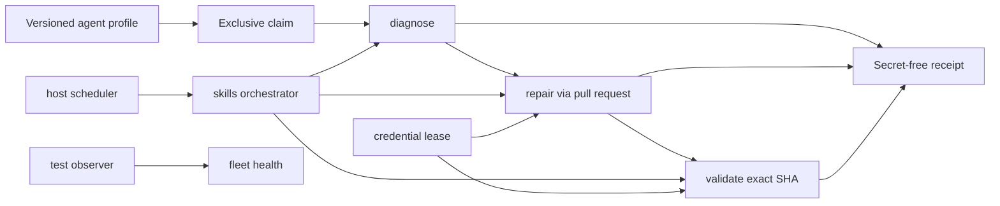
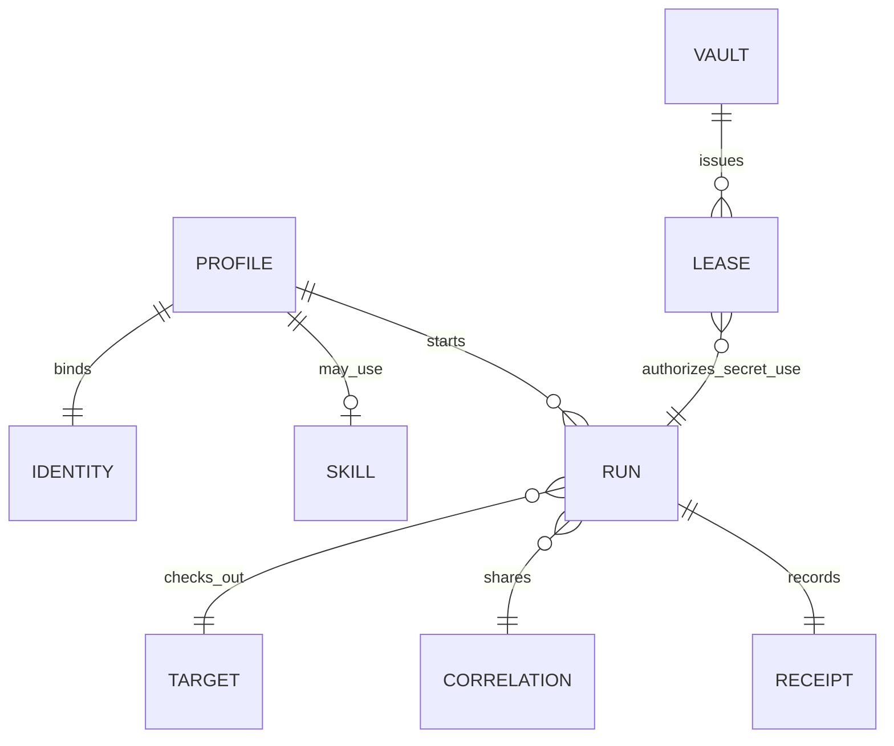

# Agent architecture

## Scope and standard composition

The agent standard describes declared roles, isolation, mutation policy and
secret-free run evidence. It does not run a fleet, store credentials, merge
pull requests or replace domain agents.

It generalizes verified Subactor experience:

- `diagit` observes local and remote fleet state as stable, target-qualified
  findings; its generated plans are evidence-bound proposals, not authority;
- `doctor-agent` diagnoses and writes evidence; it does not repair products;
- `repair-agent` claims one item and mutates only through a pull request;
- `validator-agent` independently checks an exact head SHA; LLM review is
  advisory;
- `skills-agent` orchestrates `doctor → repair → validator` and does not
  replace those execution planes;
- `test-agent` observes fleet health and writes only when separately granted;
- `onedev-agent` is a token-bearing scheduler; untrusted PR code runs, if at
  all, in a networkless executor without secrets;
- `credential-vault` issues short leases and never appears in receipts.

The current evidence basis is Diagit `b6958c40598adcc44dd02e184bc7dc92325a90b9`
and Doctor `1aed648d7c45588cf1e04d95ce315b64251c80bd`. These revisions support the
rules below but are not runtime dependencies of the standard.

Composition:

- `wellmanifest/dsl` constrains agent requests;
- POA compiles requests into exact plans, grants and receipts;
- `ticket-lifecycle` and `git-lifecycle` own ticket and Git transitions;
- `account-runtime` may later bind identity;
- `saas-lifecycle` may later bind an `agentRef` as an operational element.

## Normative invariants

1. Every profile MUST declare one `kind`, one `lane`, one `mutation` and one
   `identityRef`. Kind and lane are coupled: doctor diagnoses, repair repairs,
   validator validates, test observes, skills/control orchestrate, runtime
   executes, vault leases.
2. Only `repair` MAY mutate, and only through `pull-request`. Doctor,
   validator, skills, control, test, runtime and vault mutation is `none`.
3. `llmAuthority` is `advisory`. A model verdict cannot approve, merge or
   create a grant.
4. `storesCredentials` is always false. Credentials move through a separate
   vault lease; receipts and requests MUST NOT carry secret values.
5. A token-bearing `host-scheduler` MUST set `executesUntrustedCode=false`.
   Untrusted code, if executed, uses `networkless-executor` with no secrets.
6. Repair and validator MUST use distinct `identityRef` values.
7. `inspect`, `diagnose`, `validate` and `observe` MAY target `product` or
   `control-plane`. `claim`, `release` and non-mutating `orchestrate` MAY manage
   either lifecycle. `repair` MUST target `product`; control-plane mutation
   remains owned by its domain controller and a separate grant.
8. `repair` and `validate` require an exact 40-character head SHA.
9. An active claim (`claimed`, `diagnosing`, `repairing`, `validating`) MUST
   have a forward-bounded `claimedUntil`.
10. One `correlationRef` binds the doctor, repair and validator steps of a
    single unit of work.
11. Receipts MUST set `secretsRedacted=true` and `credentialsStored=false`.
    Documents are not execution authority.
12. Diagnostic evidence referenced by a receipt MUST preserve a stable
    diagnostic identifier or code, a deterministic fingerprint, severity,
    category, error class, retryability and the exact target identity. Evidence
    MUST be bounded and redacted before persistence.
13. A fleet finding read model MUST be filterable, paginated, strictly bounded
    and deterministically ordered. Query success or finding severity MUST NOT
    create a grant.
14. Findings about shared state MUST be deduplicated at the resource ownership
    boundary, not emitted once per checkout. The representative finding MUST
    retain bounded evidence identifying the audited members. Findings copied
    into blockers or plans MUST retain their target identity.
15. An `evidenceRef` MUST resolve to immutable evidence and SHOULD be content
    addressed. When a diagnostic run persists an operational event projection,
    it MUST compose with `wellmanifest.logs/event/v1` as a canonical
    append-only sequence with predecessor and event hashes, while stable error
    codes resolve to versioned runbooks. Invalid event order, hashes, evidence
    digests or catalog entries MUST fail closed. Existing legacy streams MUST
    NOT be silently rewritten.
16. A finding and a generated plan are observations, not authority. A plan for
    remote state MUST bind its target, source findings, count, digest and exact
    observed head plus current review/check state where applicable. Execution
    requires an external grant, independent validation and exact-state
    read-back before a successful receipt.

## Trust boundaries

| Boundary | Owns | Must reject |
| --- | --- | --- |
| Agent profile registry | Kind, lane, mutation, isolation, identity | Doctor that repairs, shared repair/validator identity |
| Skill catalog | Orchestration order and artifacts | Replacing execution agents |
| Vault | Short-lived leases | Secret values in metadata or receipts |
| Host scheduler | Polling and dispatch | Executing untrusted PR code with a token |
| Isolated workspace | Exact-SHA checkout | Host shell or arbitrary executables |
| Diagnostic projection | Stable target-qualified findings and bounded queries | Secret-bearing evidence, unbounded reads, duplicate shared-state findings |
| Domain controller | Granted mutation and exact-state read-back | Treating a finding or generated plan as authority |
| Receipt store | Redacted outcome hashes | Tokens, argv, merge commands |
| Operational event store | Canonical append-only hashes and evidence digests | Tampered chains, missing runbooks, silent legacy rewrites |

## Lane ownership

A later SaaS or product catalog may point at `agent://.../vN`. It cannot
invent a lane or turn an observer into a mutator.
