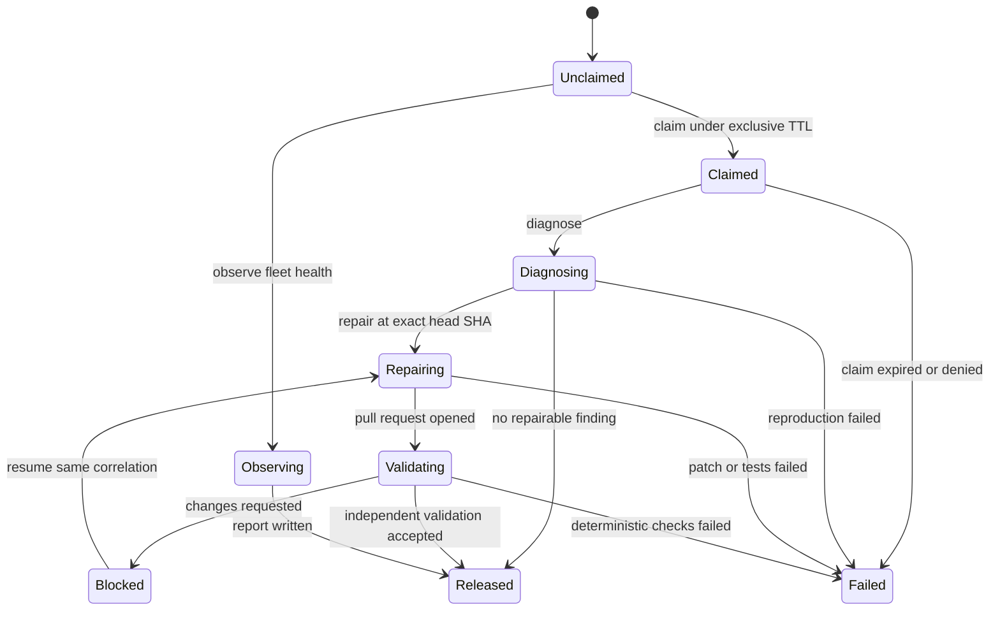
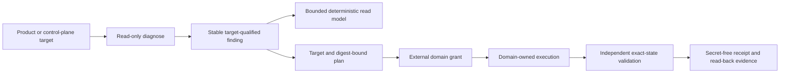
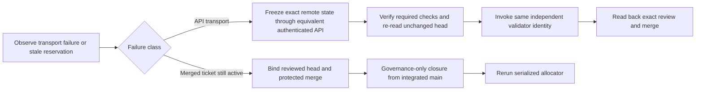
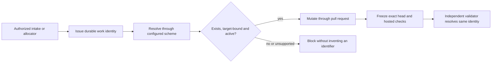
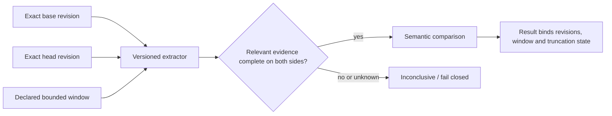
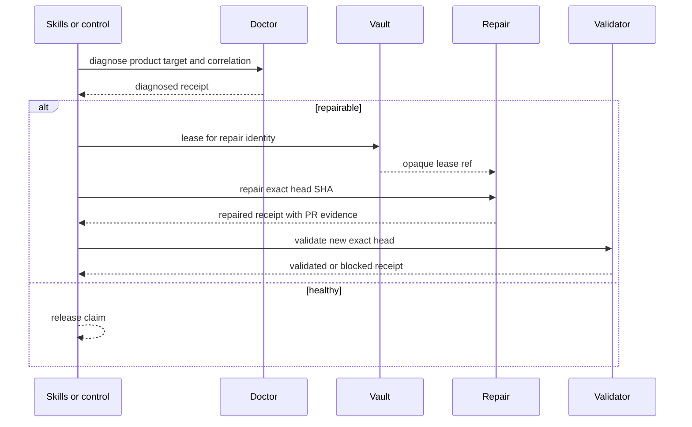
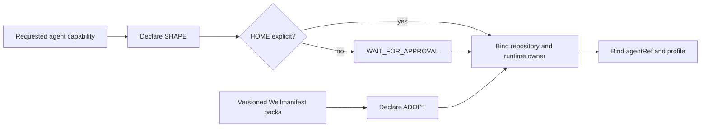

# Agent logic flow

## Diagnose, repair and validate



`inspect` and `observe` never change product state. `lease` never starts a
repair. `orchestrate` may only sequence the declared lane; it cannot apply a
patch.

## Findings, plans and control-plane observation



A diagnostic finding carries a stable diagnostic identifier or code, a
deterministic fingerprint, severity, category, error class, retryability and
the target identity. Its evidence is bounded and redacted. Fleet queries are
filterable, paginated, strictly bounded and deterministically ordered; they do
not grant execution authority.

Shared-resource state is reported once at its ownership boundary. For example,
linked Git worktrees share one stash store, so a representative finding names
the bounded set of audited worktrees instead of duplicating the finding per
checkout. When a finding becomes a blocker or plan input, its target identity
is preserved.

A plan is inert. Remote-state plans bind the exact target, source diagnostic
identifiers, finding count, digest and the observed head plus current
review/check state where applicable. A domain controller must verify an
external grant before mutation, and an independent validator must read back
the exact resulting state before success is receipted. `repair` remains a
product-only pull-request operation; read-only diagnosis and validation may
target the control plane.

## Credential discovery and runtime authority

```mermaid
sequenceDiagram
    participant B as Protected bootstrap root
    participant I as Metadata inventory
    participant C as Domain controller
    participant A as Authority service
    participant H as Credential resolver or Hub
    participant V as Password manager or Vault
    participant X as Exact connector
    B-->>C: service identity; never LLM context
    B-->>H: bounded Inventory and Vault service identity
    C->>I: discover provider/account and stable credential ref
    I-->>C: metadata only; no credential value
    C->>C: verify ticket, actor, exact route and selected ref
    C->>A: issue short grant bound to subject, route, resource, ticket and ref
    A-->>C: opaque runtime grant
    C->>X: copied runtime payload with opaque grant
    Note over X,H: exact-reference provider route must be registered
    X->>H: resolve exact granted ref
    H->>V: bounded lookup or fill
    V-->>X: short runtime use; no value in evidence
    X-->>C: bounded result and identical selection proof
    C->>A: revoke on success or failure
    A-->>C: revocation proof
    C-->>C: receipt only after proof and exact-state read-back
```

Inventory is discovery, not a password manager: it records provider/account
identity, presence, health and stable credential references. A resolver or Hub
may broker several password-manager backends, but only for the exact reference
selected by policy. It must not offer a broad secret export to an agent or LLM.

The inert request or plan may carry a declarative `grantRef`; it never carries
a usable bearer grant identifier or credential value. After readiness and
exact-route validation, the domain controller issues a short-lived grant bound
to the runtime subject, exact operation and route, provider resource, source
ticket or intent and selected vault entry. Only a copied runtime payload gets
the opaque identifier. The connector consumes this authority and cannot issue
it for itself.

The controller requests revocation after dispatch success and every dispatch
failure. Issuance without a usable proof, or revocation without proof, fails
closed; a TTL limits damage but does not replace active revocation. Persistent
receipts and operational events contain only non-replayable authority metadata
and immutable redacted evidence.

### Capability completeness and configuration bootstrap

The runtime path is ready only when all of these compatible hops are present:

1. Inventory accepts one validated, tenant-scoped reference and returns
   metadata with `secret_value_present=false`.
2. Hub binds that reference to exactly one supported account profile, store,
   origin and username after the live grant check.
3. A registered public provider route exposes the exact-reference operation.
4. The connector uses only that route when a selector is present and requires
   the identical selector in the response.
5. The domain controller owns issue, dispatch, revocation on success and
   failure, and independent Vault/read-back evidence.

An implemented consumer plus an internal resolver does not prove step 3. If
the route is absent, the state is `blocked`; the connector must not silently
drop the selector or retry through a broad provider/origin harvest. When every
hop is registered and contract-tested, the chain is structurally complete but
still not operationally ready. Readiness requires one live canary that uses a
controller-issued short grant, the exact connector/provider route and bounded
password-manager/Vault resolution, then proves revocation and independent
read-back in a secret-free receipt. A route test or orchestration double cannot
stand in for that canary.

Configuration has two separate secret classes. Workload credentials are found
as Inventory metadata and resolved from the password manager or Vault only
under the runtime grant. Bootstrap credentials are the minimum service
identities needed to call Inventory, Hub and Vault; they come from a protected
file, a system credential facility or an equivalent root of trust. Routing a
bootstrap credential through the same not-yet-reachable Hub path is circular
and fails closed. Endpoints, account ids and stable references may be ordinary
configuration, but neither secret class is supplied to the LLM.

## Fail-closed control-plane recovery



A depleted GraphQL quota, unavailable CLI projection or comparable transport
failure is not permission to retry without a bound or bypass a check. The
controller may use an equivalent authenticated REST or other supported API
only if repository, pull request, exact head, hosted checks, validator identity
and final read-back stay identical. It records the degraded transport and stops
if the head moves or any required evidence is unavailable.

Remote merge does not silently release local ticket governance. If an
`IN_PROGRESS` ticket still reserves the needed workstream, a new allocator run
must fail. Recovery verifies its exact-head review and protected merge, closes
that same ticket through a governance-only change based on integrated main,
then reruns the serialized allocator. `--force-new`, manual ticket directories
and reservation overwrite are policy bypasses, not autonomy.

### Publication work identity



The controller obtains the work identity before mutation and carries the same
canonical reference through claim, pull request, exact-head validation, merge
and integrated closure. Repository policy declares accepted schemes and the
resolver for each scheme; a validator proves existence, target ownership and
the required lifecycle state instead of accepting syntax alone. An authorized
intake may supply an existing external identity, but a PR number is not
silently promoted to one and another workstream's ticket is not reusable.

When a repository has no compatible issuer/resolver pair, the controller
records the routing gap and stops. It may add a governed identity provider or
an explicitly configured resolver in a separate change; it may not invent a
`ticket-NNN`/`PLF-N` value after implementation or use the gap to replace the
independent validator with the PR author.

## Operational evidence

Agent receipts contain immutable `evidenceRef` values rather than raw output.
The referenced operational projection must use `wellmanifest.logs/event/v1`:
canonical append-only events with monotonic sequence numbers, predecessor and
event hashes, content-addressed redacted evidence, stable error codes and
versioned runbooks. Readers fail closed on a duplicate event identity, broken
order or hash, changed evidence, or an unknown/incomplete error definition.
Legacy streams remain auditable and are never silently rewritten.

## Historical evidence windows



A history-derived result is reproducible only when it records the extractor
and tool revision, exact base/head and the same semantically sufficient bounded
window for both sides. The extractor must expose truncation or uncertainty.
When a default window evicts still-relevant claims from only one side, the
system may repeat with a larger supported bound; it must not label the artifact
as a source/intent regression. Unbounded history is not required and may create
a different denial-of-service and relevance problem.

## Control plane versus product target



Repair and validator identities stay distinct. The scheduler that holds a
GitHub token does not execute the untrusted PR head; a networkless executor
without secrets may run tests.

## Placement before profile binding



HOME answers who owns and operates the artifact; ADOPT answers which standards
constrain it. A Wellmanifest pack may be adopted by a Subactor or Semcod
runtime without moving that runtime into the Wellmanifest organization. The
phrase "w ramach wellmanifest" is insufficient placement evidence and must
leave HOME unresolved until an explicit approval supplies it.

## Failure routing

| Failure | Required state/outcome | Safe next action |
| --- | --- | --- |
| Doctor profile with `pull-request` mutation | `denied` | publish a diagnose-only profile |
| Repair and validator share `identityRef` | `denied` | split identities |
| Host scheduler executes untrusted code | `denied` | move execution to networkless executor |
| `repair` without `headSha` | `denied` | bind the exact checkout |
| `repair` targets `control-plane` | `denied` | diagnose there read-only or use the domain controller under a separate grant |
| Finding or plan lacks target, stable identity or digest binding | `denied` | regenerate from bounded diagnostic evidence |
| Operational event chain or evidence digest is invalid | `failed` | preserve the stream and investigate through its stable error runbook |
| Request contains a token or merge command | `denied` | use grant and git-lifecycle |
| Inventory or Hub returns a credential value or broad secret export | `denied` | retain metadata and resolve one exact granted reference at runtime |
| Connector attempts to issue its own authority | `denied` | move grant issuance to the domain controller after exact-route validation |
| Exact-reference consumer exists but its Hub/provider route is absent | `blocked` | publish the separately governed route and exercise an end-to-end canary; do not use legacy broad harvest |
| Hub response does not echo the exact selected reference | `failed` | reject the result and retain only bounded mismatch evidence |
| Bootstrap credential depends on the unresolved workload path | `blocked` | inject the minimum service identity from an independent protected root |
| Runtime grant issuance or revocation lacks proof | `failed` | withhold success, retry bounded cleanup and rely on the short expiry as a safety bound |
| Plan or receipt persists a bearer grant identifier | `failed` | keep the plan inert and retain only a non-replayable authority projection |
| History comparison uses an asymmetric or truncated default window | `inconclusive` | repeat with a declared sufficient bound and bind tool, base, head, window and truncation state |
| Active claim without `claimedUntil` | `failed` | expire and re-claim |
| Repairing without SHA | `failed` | stop before apply |
| Receipt stores credentials | `failed` | redact and re-issue |
| Runtime HOME inferred from an adopted Wellmanifest pack | `blocked` | keep HOME unresolved and obtain an explicit placement decision |
| Validator accepts a syntax-only, foreign or post-hoc work identity | `blocked` | configure a resolver and bind an existing target-owned record before mutation |
| Repository has no compatible work-identity issuer/resolver | `blocked` | add one through a separate governed change; do not fabricate a ticket or bypass validation |

No failure path stores a lease secret or turns a transport-level success into
a merged product change.
