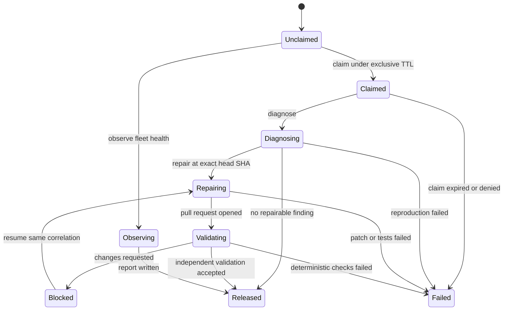
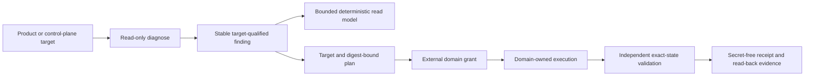
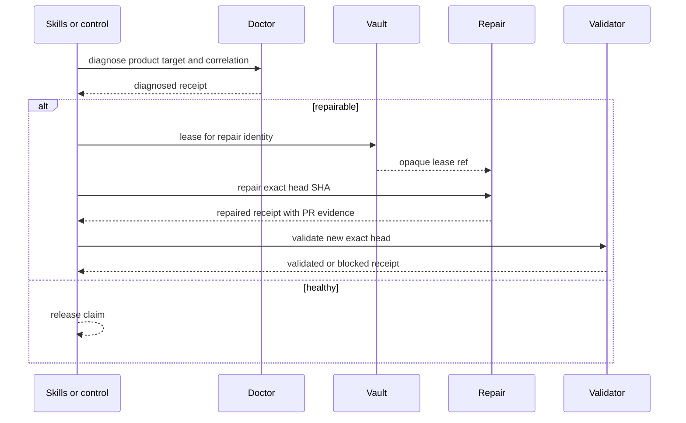

# Agent logic flow

## Diagnose, repair and validate

`inspect` and `observe` never change product state. `lease` never starts a
repair. `orchestrate` may only sequence the declared lane; it cannot apply a
patch.

## Findings, plans and control-plane observation

A diagnostic finding carries a stable diagnostic identifier or code, a
deterministic fingerprint, severity, category, error class, retryability and
the target identity. Its evidence is bounded and redacted. Fleet queries are
filterable, paginated, strictly bounded and deterministically ordered; they do
not grant execution authority.

Shared-resource state is reported once at its ownership boundary. For example,
linked Git worktrees share one stash store, so a representative finding names
the bounded set of audited worktrees instead of duplicating the finding per
checkout. When a finding becomes a blocker or plan input, its target identity
is preserved.

A plan is inert. Remote-state plans bind the exact target, source diagnostic
identifiers, finding count, digest and the observed head plus current
review/check state where applicable. A domain controller must verify an
external grant before mutation, and an independent validator must read back
the exact resulting state before success is receipted. `repair` remains a
product-only pull-request operation; read-only diagnosis and validation may
target the control plane.

## Operational evidence

Agent receipts contain immutable `evidenceRef` values rather than raw output.
The referenced operational projection must use `wellmanifest.logs/event/v1`:
canonical append-only events with monotonic sequence numbers, predecessor and
event hashes, content-addressed redacted evidence, stable error codes and
versioned runbooks. Readers fail closed on a duplicate event identity, broken
order or hash, changed evidence, or an unknown/incomplete error definition.
Legacy streams remain auditable and are never silently rewritten.

## Control plane versus product target

Repair and validator identities stay distinct. The scheduler that holds a
GitHub token does not execute the untrusted PR head; a networkless executor
without secrets may run tests.

## Failure routing

| Failure | Required state/outcome | Safe next action |
| --- | --- | --- |
| Doctor profile with `pull-request` mutation | `denied` | publish a diagnose-only profile |
| Repair and validator share `identityRef` | `denied` | split identities |
| Host scheduler executes untrusted code | `denied` | move execution to networkless executor |
| `repair` without `headSha` | `denied` | bind the exact checkout |
| `repair` targets `control-plane` | `denied` | diagnose there read-only or use the domain controller under a separate grant |
| Finding or plan lacks target, stable identity or digest binding | `denied` | regenerate from bounded diagnostic evidence |
| Operational event chain or evidence digest is invalid | `failed` | preserve the stream and investigate through its stable error runbook |
| Request contains a token or merge command | `denied` | use grant and git-lifecycle |
| Active claim without `claimedUntil` | `failed` | expire and re-claim |
| Repairing without SHA | `failed` | stop before apply |
| Receipt stores credentials | `failed` | redact and re-issue |

No failure path stores a lease secret or turns a transport-level success into
a merged product change.
