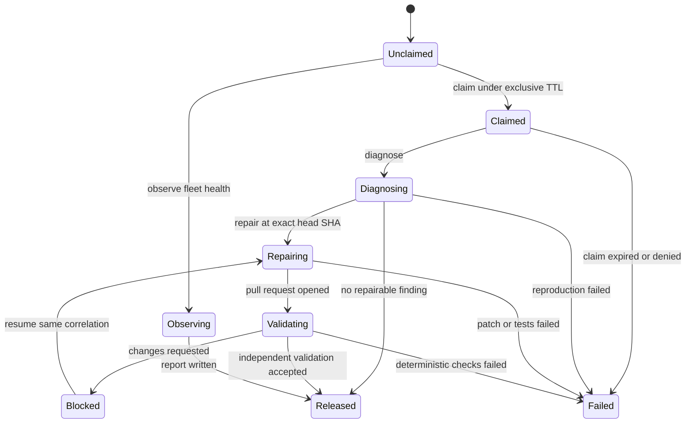
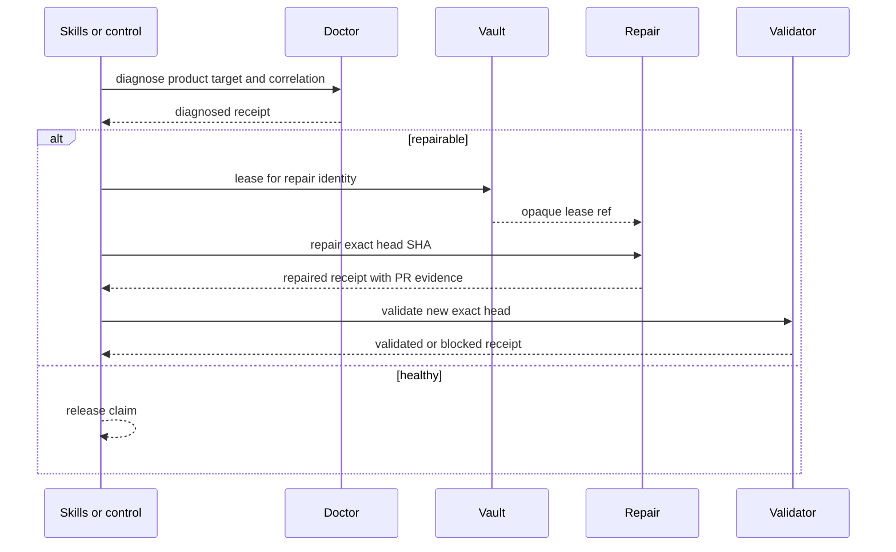

# Agent logic flow

## Diagnose, repair and validate

`inspect` and `observe` never change product state. `lease` never starts a
repair. `orchestrate` may only sequence the declared lane; it cannot apply a
patch.

## Control plane versus product target

Repair and validator identities stay distinct. The scheduler that holds a
GitHub token does not execute the untrusted PR head; a networkless executor
without secrets may run tests.

## Failure routing

| Failure | Required state/outcome | Safe next action |
| --- | --- | --- |
| Doctor profile with `pull-request` mutation | `denied` | publish a diagnose-only profile |
| Repair and validator share `identityRef` | `denied` | split identities |
| Host scheduler executes untrusted code | `denied` | move execution to networkless executor |
| `repair` without `headSha` | `denied` | bind the exact checkout |
| Diagnose or repair a `control-plane` target | `denied` | keep agents off the product lane |
| Request contains a token or merge command | `denied` | use grant and git-lifecycle |
| Active claim without `claimedUntil` | `failed` | expire and re-claim |
| Repairing without SHA | `failed` | stop before apply |
| Receipt stores credentials | `failed` | redact and re-issue |

No failure path stores a lease secret or turns a transport-level success into
a merged product change.
